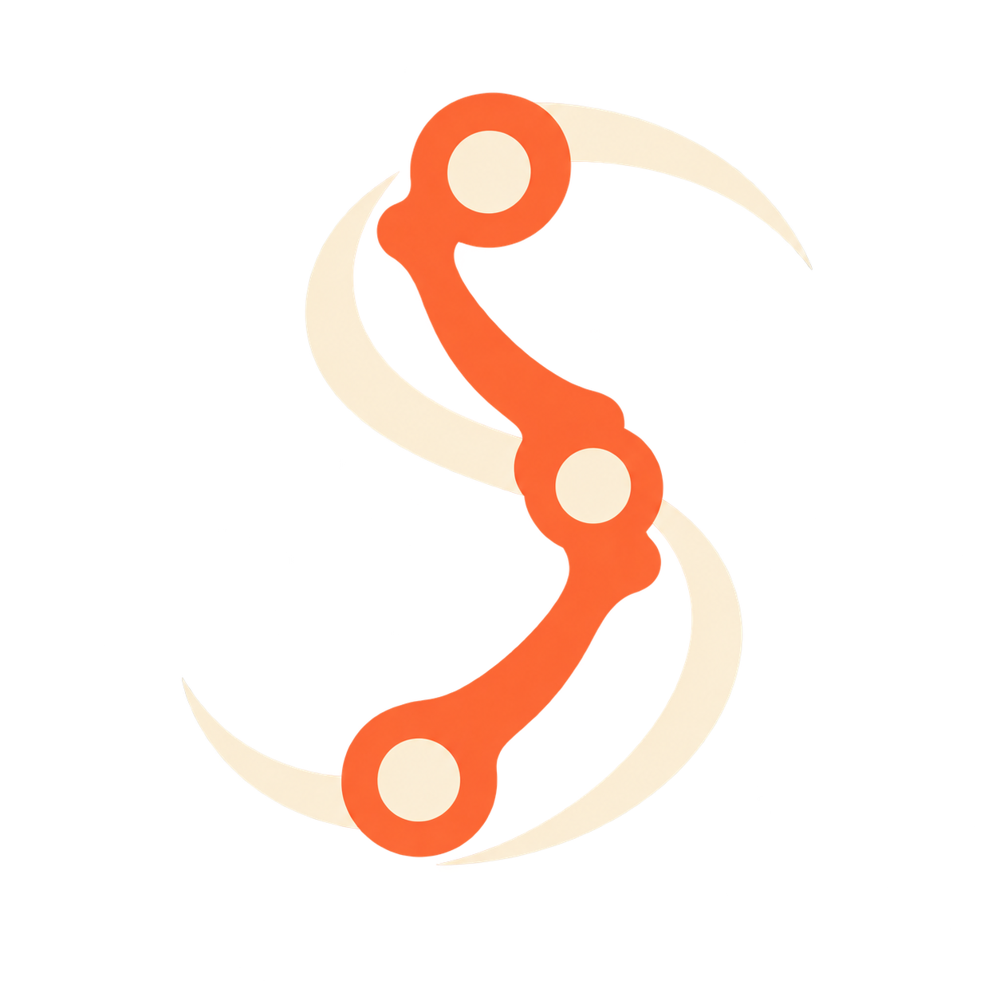
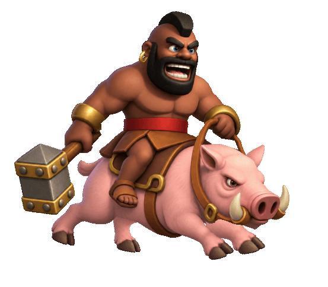

<p align="center">
  
</p>

<h1 align="center">Spine Animation</h1>

<p align="center"><strong>动作有表现力，形体可信，工程可继续编辑。</strong></p>

<p align="center">用于制作、编辑和修复 Spine 2D 骨骼动画的 Agent Skill。</p>

<p align="center"><a href="README.md">English</a> · <strong>简体中文</strong></p>

<p align="center">
  <a href="#安装">安装</a> ·
  <a href="#使用">使用</a> ·
  <a href="#示例野猪骑士">动画示例</a> ·
  <a href="skills/spine-animation/SKILL.md">阅读英文技能正文</a>
</p>

## 示例：野猪骑士

<p align="center">
  
</p>

<p align="center"><em>用户认可的 v008 · Spine 原生导出 · 25 FPS 循环 GIF</em></p>

这个项目经历了真实的多轮修复：肢体变形、动作僵硬、肩胯体积丢失，以及鼻息横穿鼻面。最终认可的版本恢复了角色形体，协调腿根运动与节奏，并把两股鼻息分别固定到鼻孔内部。

[案例记录](skills/spine-animation/references/diagnosis-and-lessons.md#validated-case-hog-rider-v008)保留了修复方法和验证边界。GIF 用于便捷展示，二值透明无法完整还原运行时烟雾的半透明边缘。四足奔跑只是技能的一个应用分支，不是套用到所有动画的固定模板。

## 能做什么

| 动画类型 | 关注重点 |
| --- | --- |
| 角色表演 | 姿势、情绪、视线、表情、对话、有意图的停顿 |
| 战斗与反应 | 准备、作用点、后坐、收势、受击、死亡、打断 |
| 运动与跳跃 | 支撑、推进、弧线、重心、落地、骑手与道具随动 |
| 机械装置 | 转轴、刚性、传动、接触、行程极限 |
| 柔性形体 | 布料、头发、触手、惯性、波的传递、受控变形 |
| 转身与变形 | 替换视角、附件切换、轮廓、遮挡 |
| 特效 | 源点对齐、局部/世界空间、发射、脱离、消散 |

技能涵盖参考分析、素材准备、绑定选择、姿势与时间设计、视觉诊断、原生编辑器检查及交付。根据镜头需求选择 FK、IK、网格、约束和次级运动；“丝滑”也包含有意设计的加速、击打顿帧和机械停顿。

**这个仓库提供的是 Agent 工作指令。** 安装技能不会安装 Spine、提供运行时 SDK，也不等于一键自动生成动画。Agent 仍需要相应工具及项目访问能力。

## 安装

任选一种方式。可安装内容位于 `skills/spine-animation/`，配套参考文件需要一起安装。README 的图片、示例 GIF 和可选的完整中文手册不会进入技能目录。

### 1. 命令行安装

已安装 Node.js 与 npm/npx 时运行：

```sh
npx skills add zxzAndyMAC/Spine-SKILL --skill spine-animation
```

安装器会提供 Agent 和安装范围选择。指定用户级安装：

```sh
# Codex
npx skills add zxzAndyMAC/Spine-SKILL --skill spine-animation --agent codex --global

# Claude Code
npx skills add zxzAndyMAC/Spine-SKILL --skill spine-animation --agent claude-code --global
```

去掉 `--global` 即为项目级安装。安装前可只检查技能发现结果：

```sh
npx skills add zxzAndyMAC/Spine-SKILL --list
```

使用的是现有的 [Skills CLI](https://github.com/vercel-labs/skills)，无需自定义安装器。本地发现与安装已用 CLI 1.7.1 检查。该 CLI 支持的其他 Agent 可通过交互选择安装；实际动画制作能力取决于 Agent 可用的工具。

### 2. 在 Agent 中用自然语言安装

将下面这段话发给具有技能安装能力、能访问 GitHub 或本地仓库的 Agent：

```text
请从 https://github.com/zxzAndyMAC/Spine-SKILL 为当前 Agent 安装用户级
spine-animation 技能。技能位于 skills/spine-animation/，请完整安装该目录，
包括 references 和 agents 元数据。使用你支持的技能安装器或 Skills CLI。
如果已有同名技能，请先展示差异再替换。安装后验证技能能被发现。
不需要安装 Spine 软件，也不要运行示例工程。
```

只有聊天功能、没有文件系统或安装工具的界面无法执行安装。安装后按 Agent 的要求刷新技能列表或开启新会话。

### 3. Clone 后本地安装

```sh
git clone https://github.com/zxzAndyMAC/Spine-SKILL.git
cd Spine-SKILL
npx skills add . --skill spine-animation --agent codex --global
```

不使用 Node.js 时，可将**整个** `skills/spine-animation` 文件夹复制到 Agent 的技能目录：

| Agent | 用户级目标目录 |
| --- | --- |
| Codex | 设置了 `CODEX_HOME` 时使用 `$CODEX_HOME/skills/spine-animation`；否则为 `~/.codex/skills/spine-animation` |
| Claude Code | `~/.claude/skills/spine-animation` |
| 其他 Agent | 使用其文档规定的技能目录，保留完整文件夹 |

例如，在 clone 后的仓库目录运行以下 Python 3 命令安装到 Codex；目标已存在时会拒绝覆盖：

```sh
python3 - <<'PY'
import os
import shutil
from pathlib import Path

codex_dir = Path(os.environ.get("CODEX_HOME") or Path.home() / ".codex").expanduser()
destination = codex_dir / "skills" / "spine-animation"
destination.parent.mkdir(parents=True, exist_ok=True)
shutil.copytree("skills/spine-animation", destination)
print(f"Installed: {destination}")
PY
```

目标目录已存在时，先比较差异、备份自己的修改，再选择更新方式。只复制 `SKILL.md` 会导致参考链接失效。

## 使用

在 Codex 中调用 `$spine-animation`；其他 Agent 使用其技能调用语法，或直接要求使用已安装的 Spine Animation 技能。技能文件为英文，但请求可以使用中文、英文或其他语言。

```text
使用 $spine-animation，为这个角色制作有重量感的施法动作，包括准备、释放、
后坐和收势。保留原角色轮廓，交付可编辑 Spine 工程和可播放预览。
```

```text
使用 $spine-animation，修复这个机械臂抓握点滑动、回收时肘关节突跳的问题。
保留已经认可的动作时间和素材。
```

```text
使用 $spine-animation，制作从好奇到受惊的表情表演，协调眼睛、眉毛和头部。
在游戏实际显示尺寸下仍要能读懂情绪。
```

建议提供当前工程或素材、动作意图或参考、不可改变的造型，以及目标视角或播放环境。修复时尽量指出版本、区域和发生问题的时间段。

## 制作流程

1. **读取当前作品。** 区分身份、画风和动作参考，保留已认可的部分。
2. **设计动作。** 明确意图、关键姿势、接触点、时间与起止行为。
3. **保住形体。** 先还原静态素材，再测绑定的极限姿势。
4. **建立运动。** 先主动作，再弧线、曲线、重叠运动和特效。
5. **检查真实播放。** 在编辑器与目标播放器查看全身、局部、插值姿势和边界。
6. **交付可编辑成果。** 保存权威工程、验证路径，分别记录已验证结果与待确认反馈。

完整制作通常交付 `.spine` 工程、相对路径素材、运行时导出、可播放审核 HTML，以及简明的 `PROJECT.md`。只诊断或局部修复时，按用户要求控制范围。

## 环境与兼容性

- 支持文件夹形式技能的 Agent；制作工程需要文件系统及命令行能力。
- Spine Editor，以及满足所需功能和保存操作的授权/版本。技能安装不包含软件或授权。
- 原生界面自动化或人工协助，用于编辑器操作与视觉检查；创建或修复位图素材时需要图像生成/编辑工具。
- 要求网页交付时，需要浏览器及兼容的 Spine runtime/player。每个项目都要核对编辑器与运行时兼容性。

示例使用 **Spine 4.3.26** 制作。技能不固定要求这个版本，而是指导 Agent 核对目标环境。桌面播放不能证明手机性能达标，审核页动作切换也不代表已经完成游戏引擎集成。

## 仓库结构

```text
skills/spine-animation/
├── SKILL.md                         # 工作流程与参考入口
├── agents/openai.yaml               # Codex 界面元数据
└── references/
    ├── motion-and-rig.md            # 动作设计、绑定、衔接
    ├── diagnosis-and-lessons.md     # 视觉问题、特效、成功案例
    ├── editor-delivery.md            # 版本、回导、播放、交付
    └── spine-4.3-feature-index.md   # 不常见编辑器功能的路由
assets/                             # README logo 和生成提示词
examples/hog-rider/                  # 已认可动画示例
docs/Spine-4.3-complete-manual.zh-CN.md # 可按需查阅的完整 4.3 手册
README.md                           # 默认英文版
README.zh-CN.md                      # 简体中文版
```

完整手册保留在 `docs/`，用于按需查询；它不会随 skill 默认加载。遇到具体功能时，先查功能索引，再只读取对应章节。

## 参与贡献

欢迎通过 Issue 或 Pull Request 提供具体故障、编辑器/运行时版本、预期效果和可复现证据。修改应解决已观察到的问题，保留多类动作适用性；安装方式或公开行为变化时同步更新双语 README。请勿提交未经许可的专有素材。

## 许可与致谢

技能指令和仓库文档采用 [MIT License](LICENSE)。图片与动画不包含在该授权中，详见[素材说明](ASSET-NOTICES.md)。

这是独立社区项目，与 Esoteric Software 或 Supercell 无隶属关系。Spine 是 Esoteric Software 的产品。野猪骑士示例是受 *Clash Royale* 启发、由 AI 辅助制作的同人动画练习；相关角色与游戏标识属于各自权利人。示例用于展示制作流程，不提供游戏资产复用授权。
